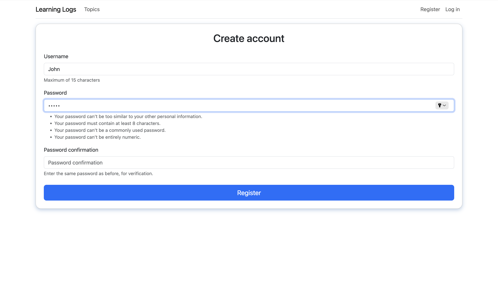
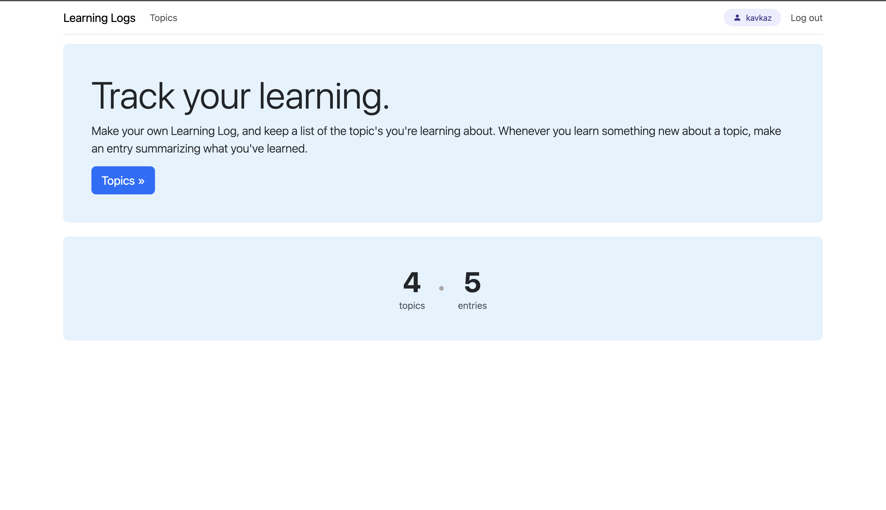
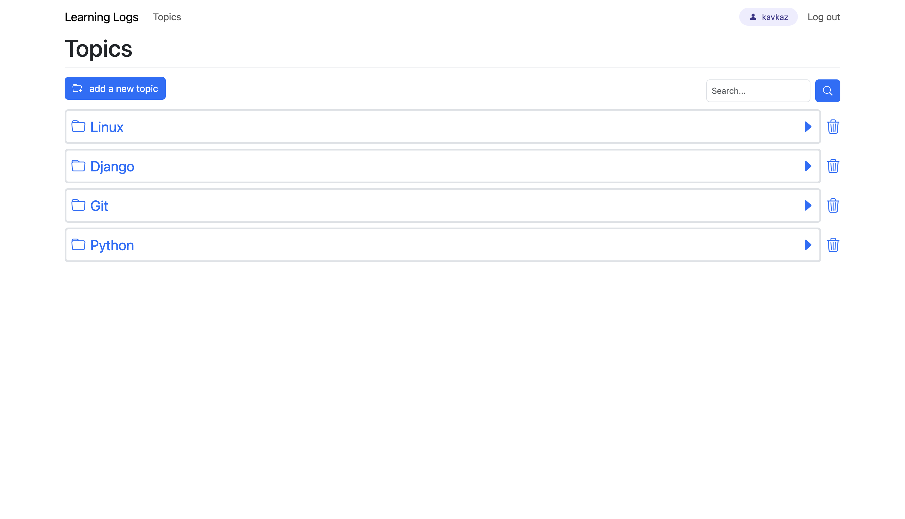
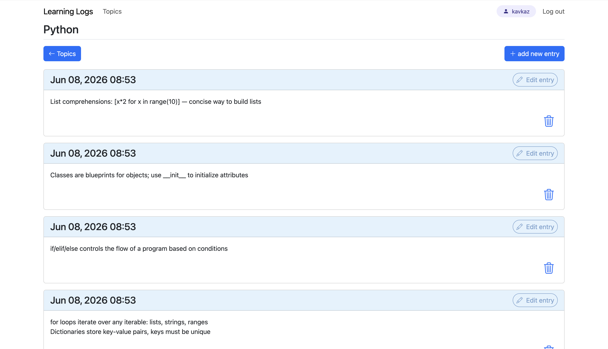

# Learning Log
A Django web app for tracking learning topics and journal entries.

## Features
- Register and log in to your personal account
- Create, view, and delete learning topics
- Add and delete journal entries for each topic
- Search topics 

## Tech Stack
- Django 6
- Bootstrap 5
- SQLite
- Gunicorn + Nginx (deployed on VPS)

## Getting Started
1. Clone the repo
2. Install dependencies: pip install -r requirements.txt
3. Run migrations: python manage.py migrate
4. Start the server: python manage.py runserver

## Screenshots

